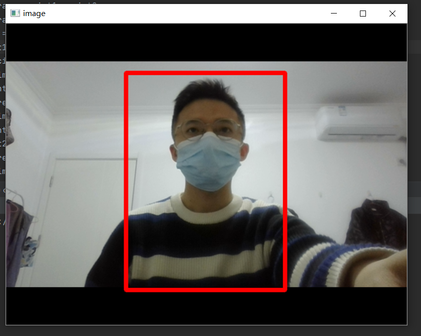

# yolov8 Reid

检测：将  **ReID_resnet50_ibn_a.pth**放在:ear:**Reid_Search/weights**文件下，yolov8s.pt放**Reid_Search**下 【文末有权重链接】

该项目可用于做reid识别，可用于做**跨视频人员识别**

reid网络采用resnet50_ibn_a（权重需要和defaults.py中的MODEL.NAME对应），支持se_resnext50网络。权重见文末百度盘链接。

:electric_plug:注意：

该项目<u>没有将yolov8训练加入</u>，只是将检测功能和reid进行了整理。

**person_search下只进行检测**，不进行reid的训练，reid的训练在yolov8_reid中。

# 从视频中获取陌生人(待检测人员)图像

```shell
python get_query.py
```

可从弹出的视频中利用鼠标框选待检测的人员(陌生人员)。

操作方法：

​		运行程序后用鼠标左键从目标左上角进行框选，按“空格”键继续播放视频(会自动把框选的图像进行保存)

该人员图像会保存在query文件夹中，**默认命名格式为markt1501**。

ps:也可以直接将图像放在query文件中，但名字也需要按mark1501命名。

<p align="center">
  
</p>

# 人员查找

参数说明：

--weights: yolov8权重路径

--source: video/file/ path

--imgsz: 输入图像大小，默认640

--dist_thres:reid对比的距离阈值(**小于该阈值判断为同一个人**)

--save:保存视频图像

```shell
python search.py --weights yolov8s.pt --source demo.mp4 --dist_thres 1.
```

如果需要检测视频或者多视频(跨视频检测)，需要指定source路径。

<p align="center">
    <video src="runs/detect/exp/demo.mp4"></video>
</p>

**检测后的视频会保存在runs/detect/下**

**检测代码有偿使用。**

wechat:y24065939s


# 权重下载

检测：将  **ReID_resnet50_ibn_a.pth**放在:ear:**Reid_Search/weights**文件下，yolov8s.pt放**Reid_Search**下 

链接：https://pan.baidu.com/s/1C4aQIr82kjQEdY-E0H8i3A 
提取码：yypn 


